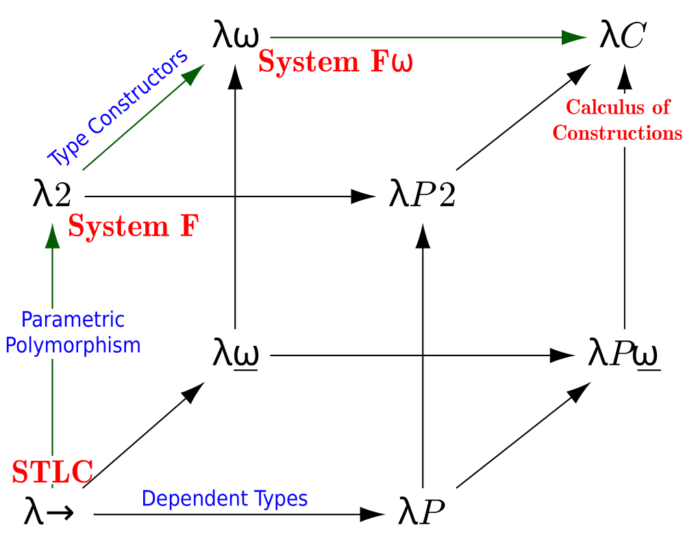

# Parametric Polymorphism

[Parametric Polymorphism](../reading/ParametricPolymorphism.pdf) - Frank Pfenning

At this point, we've implemented the STLC and a bidirectional type checker that allows users to elide certain type annotations.
In this chapter, we will extend our type checker to **System F**, an extension to the STLC that adds **polymorphic functions**, or, functions that can take arguments of any type.
The simplest example is the polymorphic identity function,

$$
\Lambda \alpha. \lambda x : \alpha. x
$$

where $\alpha$ is a **type variable** that may be instantiated with any type to describe the type of $x$.
In the STLC, we would need to explicitly define, for example, a `nat`-typed identity function, a `bool`-typed identity function, and so on.
In the reading, Pfenning motivates polymorphic functions with the example of an `add` function that can take on either `int -> int -> int` or `float -> float -> float` depending the types of its arguments.
Another motivation: our implementation of the STLC included built-in bools.
If one wanted to [Church-encode](https://en.wikipedia.org/wiki/Church_encoding#Church_Booleans) the booleans, even constructing something as simple as an `if-then-else` function would require, like the identity function example, a `nat-bool` definition, a `unit-bool` definition, etc. for each return type of `if-then-else`.
A polymorphic `if-then-else` does not have this problem.
For now, the identity function will be about the most interesting polymorphic function we can implement without baking in some more operations and fundamental datatypes to our type system (or un-baking things like bools, which this reference implementation will not do just yet), but the utility of polymorphic functions will soon become clear.

This chapter marks our first foray onto the edges of the *lambda cube*, a map of type system extensions that guides an implementer towards a highly-expressive calculus called the **Calculus of Constructions**.
This language is at the heart of dependently-typed proof checkers like [Rocq](https://rocq-prover.org/), [Lean](https://lean-lang.org/), and [Agda](https://wiki.portal.chalmers.se/agda/pmwiki.php).
Although this is the final point on the cube, the set of paths along the way describe the primary features necessary to implement real-world programming language type systems like those of [OCaml](https://ocaml.org/), [Haskell](https://www.haskell.org/), and [Rust](https://rust-lang.org/) (although each substantially extends the features we'll see here).

The following figure shows the lambda cube with annotations relevant to our coursework.
Each direction represents a feature one can add to a type system (so the edges from $\lambda\to$ to $\lambda2$ and $\lambda P$ to $\lambda P2$ both represent parametric polymorphism).
In this course, we will take the green path: polymorphism, then type constructors, then dependent types (this path is fairly standard and traverses features from most-familiar to least-familiar).
Thus, by adding polymorphism to our STLC, we will reach an implementation of [System F](https://en.wikipedia.org/wiki/System_F), which was proposed independently by Jean-Yves Girard and John C. Reynolds in the 1970s.



## System F

System F has just a few more syntactic additions over the STLC.
As seen earlier, terms can now contain capital lambdas: $\Lambda \alpha. e$.
These are term-level constructs that describe polymorphic functions.
In fact, they themselves are functions that consume a type and produce a term (Remember this dichotomy! As we traverse the lambda cube, it will help your intuition).
$\alpha$ is a **type variable** that functions very similar to term-level variables.
When applying a polymorphic function to an argument, we will explicitly annotate the argument's type (for now): `(/\'a.\x:'a.x) [nat] 5`.
Finally, these term-level constructs are described by the type $\forall \alpha . t$, pronounced "for all" or "forall."
The typing judgements are fairly straightforward:

$$
\frac{\Gamma, \alpha \vdash e : T}{\Gamma \vdash \Lambda \alpha. e : \forall \alpha. T}
$$
$$
\frac{\Gamma \vdash e : \forall \alpha. \beta \quad \kappa \textrm{ is well-formed}}{\Gamma \vdash e [\kappa] : \beta[\kappa/\alpha]}
$$

Before reading on, consider what it means for a type to be well-formed or ill-formed.

## Our Implementation

Our development of System F begins with the aforementioned [syntactic extensions](./lib/syntax.ml).
I've also added **phrases**, which distinguish between anonymous terms that get evaluated as the REPL/file interpreter reaches them, and reusable definitions that are substituted in as needed.
If you check out the updated [lexer](./lib/lexer.mll), you might notice that type variables must be preceded by an apostraphe.
I challenge you to maintain a parser that permits both term- and type-level variables without such a discriminator!
It is of course feasible (see the implementation language, OCaml), but this precludes some frustrating parser conflicts.
Finally, we must implement type-level capture-avoiding substitution for when we begin typechecking and need to perform the substitution `(/\'a.\x:'a.x) [nat] 5  -->  (\x:nat.x) 5`.

Think back to the bidirectional typing chapter.
Our typechecker had a `synth` component and a `check` component that divided up the syntactic structures we supported.
Consider whether the rules for polymorphic functions and their applications will go in `synth` or `check` before reading on.


Recall the split from the last chapter: **elimination** forms synthesize, and **introduction** forms check.
$\Lambda \alpha. e$ introduces a $\forall$, and $e [T]$ eliminates one.
Because type application is an elimination form, it goes in `synth`:

$$
\frac{\Gamma \vdash e \Rightarrow \forall \alpha. B \quad \Gamma \vdash T \textrm{ well-formed}}{\Gamma \vdash e [T] \Rightarrow B[T/\alpha]}
$$

To instantiate $e$, we need to know that its type is a $\forall$, and what its body is.
Synthesizing the type of $e$ gives us exactly that:

```ocaml
  (* G |- e => forall 'a.'b => G |- 'k type => G |- e['k] => 'b['a := 'k] *)
  | SPolyApp (e, Some kappa) -> (
      let* e', ety = synth gamma e in
      match ety with
      | TForall (alpha, beta) ->
          if type_wf gamma kappa then return (e', tcas beta alpha kappa)
          else
            fail
              (Printf.sprintf "Type [%s] is not well-formed"
                 (string_of_typ kappa))
      | _ ->
          fail
            (Printf.sprintf "Expected polymorphic type but got %s"
               (string_of_typ ety)))
```

```
>> (/\'a. \x:'a. x) [nat] 5;;
5 : nat
>> (\x:nat. x) [nat];;
[ERROR] Expected polymorphic type but got nat -> nat
```

$\Lambda \alpha. e$ is an introduction form, so following the last chapter it should only have a check rule.
However, our typechecker has *both* a synth rule and a check rule for it:

$$
\frac{\Gamma, \alpha \vdash e \Rightarrow B}{\Gamma \vdash \Lambda \alpha. e \Rightarrow \forall \alpha. B}
$$
$$
\frac{\Gamma, \alpha \vdash e \Leftarrow B}{\Gamma \vdash \Lambda \alpha. e \Leftarrow \forall \alpha. B}
$$

The synth rule is the one from the start of this chapter, and it works whenever the body synthesizes on its own.
Most of the time it does, as in the identity function, whose binder is annotated:

```
>> /\'a. \x:'a. x;;
\x.(x) : forall 'a.('a -> 'a)
```

But when the body is an unannotated lambda, it can only be *checked*, and so the synth rule fails.
This is where the check rule comes in: if we know that the whole term should have type $\forall \alpha. B$, we can check the body against $B$, which pushes the type $\alpha \to \alpha$ into `\x. x`:

```
>> /\'a. \x. x;;
[ERROR] Cannot synthesize type for term \x.(x)
>> (/\'a. \x. x : forall 'a. 'a -> 'a);;
\x.(x) : forall 'a.('a -> 'a)
```

This is the same split we saw for term-level lambdas in the last chapter: an annotated `\x:T. e` synthesizes, and an unannotated `\x. e` checks.

The expected type doesn't have to use the same name for its bound variable as the term does: `/\'a. \x. x` should also check against `forall 'b. 'b -> 'b`.
So the check rule first renames the expected type's variable to the term's, $B[\alpha/\beta]$, and then checks the body against that:

```ocaml
  (* G['a := true] |- e <= B => G |- /\'a.e <= forall 'a. B *)
  | STLam (alpha, e), TForall (alpha', b) ->
      let alpha, e = bind_tyvar gamma alpha e in
      let* e' =
        check (update_tyvar gamma alpha) e (tcas b alpha' (TVar alpha))
      in
      return e'
```

Here, `bind_tyvar` renames `alpha` if necessary to avoid clashes in `e`.

In the last chapter, `()`, `true`, `false` and numbers only had check rules, to follow the presentation in the paper, which meant that `5;;` couldn't be typechecked on its own.
For convenience, we give these synth rules now (we won't be implementing any features that would necessitate the subformula property anyways).

## Well-Formed Types

What makes a type well-formed?
Type variables are variables just like term variables are, and so, just like a term may not mention an unbound variable, a type may not mention an unbound type variable.
A type is **well-formed** under $\Gamma$ if every type variable in it is bound, either by a $\forall$ inside the type itself, or by an enclosing $\Lambda$.

To track the second case, the typing context now has two parts: the types of term variables, as before, and the set of type variables in scope.
Checking the rule $\Gamma \vdash \Lambda \alpha. e$ adds $\alpha$ to that set while checking $e$.
`type_wf` walks user-annotated types and ensures variables are in scope:

```ocaml
let rec type_wf (gamma : typctx) (t : typ) : bool =
  match t with
  | TUnit | TBool | TNat -> true
  | TVar v -> List.mem v gamma.tyvars
  | TArrow (t1, t2) -> type_wf gamma t1 && type_wf gamma t2
  | TForall (alpha, t') -> type_wf (update_tyvar gamma alpha) t'
```

## Type Equality

In the STLC, two types were equivalent if they were syntactically identical, so OCaml's `=` was correct.
Now that types have binders, that's no longer true: `forall 'a. 'a -> 'a` and `forall 'b. 'b -> 'b` should be the same type, just like `\x.x` and `\y.y` are the same function.
Two types are equal if they are equal up to renaming of bound variables, or **alpha-equivalent**.

`types_eq` checks this by comparing two `forall`s' bodies with both of their bound variables replaced by the same fresh variable:

```ocaml
let rec types_eq (t1 : typ) (t2 : typ) : bool =
  match (t1, t2) with
  | TVar x, TVar y when x = y -> true
  | TUnit, TUnit | TBool, TBool | TNat, TNat -> true
  | TArrow (t1, t2), TArrow (t3, t4) -> types_eq t1 t3 && types_eq t2 t4
  | TForall (a, x), TForall (b, y) when a = b -> types_eq x y
  | TForall (a, x), TForall (b, y) ->
      let gamma = fresh "gamma" (tfree x @ tfree y) in
      types_eq (tcas x a (TVar gamma)) (tcas y b (TVar gamma))
  | _, _ -> false
```

The `Sub` rule uses it to compare synthesized types with expected ones:

```
>> (/\'a. \x:'a. x : forall 'b. 'b -> 'b);;
\x.(x) : forall 'b.('b -> 'b)
```

## Type Capture-Avoiding Substitution

The type application rule computes $B[T/\alpha]$, replacing the bound variable with the type argument.
Just like substitution in terms, this has to be **capture-avoiding**, and our implementation `tcas` follows the same recipe as `cas` from the untyped lambda calculus.

Suppose `f : forall 'a. forall 'b. 'a -> 'b`, and we instantiate `'a` with some *other* `'b` that's in scope (i.e. `/\'b. f ['b]`).
Naively substituting into `forall 'b. 'a -> 'b` gives `forall 'b. 'b -> 'b`, where the outer `'b` has been captured by the inner binder, and the result claims something much stronger than `f` promised.
Instead, `tcas` renames the inner binder out of the way:

```
>> \f:(forall 'a. forall 'b. 'a -> 'b). /\'b. f ['b];;
\f.(f) : forall 'a.(forall 'b.('a -> 'b)) -> forall 'b.(forall 'b0.('b -> 'b0))
```

Type variable names can collide in another way.
Consider this term:

```
(/\'a. \y:'a. (/\'a. y) [nat]) [bool] true
```

The inner `/\'a` **shadows** the outer one, but `y`'s type mentions the *outer* `'a`.
If the typechecker simply adds the inner `'a` to the context and carries on, the inner `/\'a. y` synthesizes `forall 'a. 'a`, capturing `y`'s `'a`.
Instantiating it with `[nat]` would then give `y` the type `nat`, and the whole term would have type `nat`, even though it evaluates to `true`!

To keep the two variables apart, when `/\'a. e` is entered while another `'a` is already in scope, `bind_tyvar` renames the new one to a fresh variable, both in the context and in the type annotations inside `e`:

```ocaml
let bind_tyvar (gamma : typctx) (alpha : string) (e : sterm) : string * sterm =
  if not (List.mem alpha gamma.tyvars) then (alpha, e)
  else
    let alpha' = fresh alpha (gamma.tyvars @ stnames e) in
    (alpha', strename e alpha alpha')
```

## Type erasure

Type abstractions and type applications are purely for the typechecker, so type erasure removes them entirely: `/\'a. e` erases to `e`, and `e [T]` erases to `e`.

```
>> /\'a. \x:'a. x;;
\x.(x) : forall 'a.('a -> 'a)
```

## Impredicativity

Nothing stops a type argument from being a polymorphic type itself.
We can instantiate the identity function with the type of the identity function:

```
>> (/\'a. \x:'a. x) [forall 'b. 'b -> 'b];;
\x.(x) : forall 'b.('b -> 'b) -> forall 'b.('b -> 'b)
```

A system where a $\forall$ can quantify over types that contain $\forall$s, including its own, is called **impredicative**.
This is a large part of what makes System F so expressive, and it is also why full type inference for System F is undecidable.
Hindley-Milner, in [chapter 4b](../4b_hm), gets type inference back by restricting where polymorphism can appear.

## Progress

## Preservation
